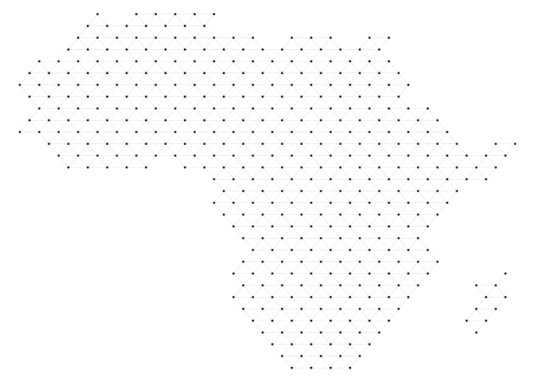
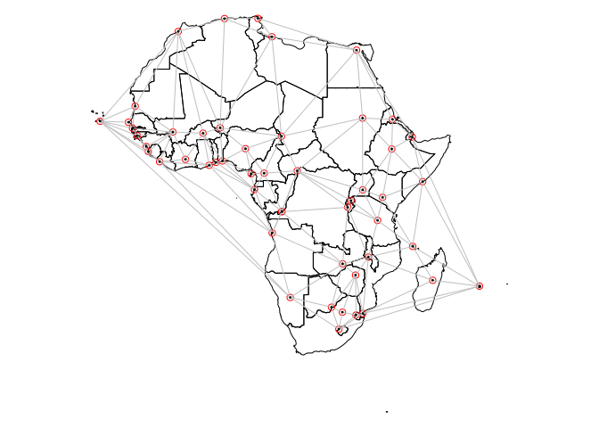
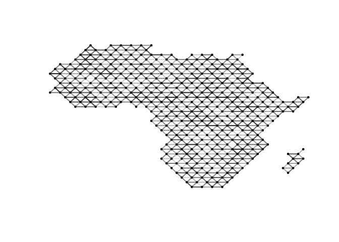

# SpatialLattice: Spatial Graph Manipulation in R

## Introduction

This R-package provides a number of functions to create spatial graph
data. By providing a set of standard manipulation functions, it aims to
facilitate the analysis of spatial partitionings such as state
territories or administrative divisions through the
[pspm](https://github.com/carl-mc/pspm) package.

When using the SpatialLattice package, please cite:

Müller-Crepon, Carl, Guy Schvitz, Lars-Erik Cederman (2023). Shaping
States into Nations: The Effects of Ethnic Geography on State Borders.
*American Journal of Political Science*, conditionally accepted for
publication.

Please note that we intend this package to be further developed by
ourselves as well as other members of the community. Please do not
hesitate to submit issues, contribute directly, or get in touch with us.

## Installation

Please install the package directly from this github page.

``` r
# Download SpatialLattice package
library(devtools)
install_github(repo = "carl-mc/SpatialLattice")
```

## Creating spatial graph data

Spatial graphs can take a huge variety of forms. The functions included
in the package create *planar* graphs, that is graphs that can be drawn
on a plane such that its edges do not cross each other. The examples
below produce such spatial lattices to cover the African continent. Each
graph takes the form of an with an “x” and “y” vertex attribute which
indicate the vertices spatial location.

``` r
# Load some libraries needed below
library(SpatialLattice)
library(igraph)
library(sp)
library(cshapes)
library(sf)

# Set a random seed
set.seed(1)

# Load country borders in Africa
africa <- cshp(date = as.Date("2000-01-01"))
africa <- africa[africa$gwcode %in% c(400:626,651),]
africa <- as_Spatial(africa)
```

### Regular grid structures

The package implements a number of regular grid structures. It provides
an interface to create graphs from vertices sampled with a quadratic,
hexagonal, triangular, and random sampling structure. A function
facilitates spatial plotting using R base plots.

``` r
# Sample grid with hexagonal structure
grid <- spatial_grid(shape = africa, 
                     structure = "hexagonal",
                     N_pts = 500)

# Print vertex attributes
print(vertex_attr_names(grid))
```

    ## [1] "name" "x"    "y"

``` r
# Plot spatial graph
par(mar = c(0,0,0,0))
plot_spatial_graph(grid)
```

<!-- -->

### Graphs from polygons

We can also create graphs from polygons, where each polygon becomes one
vertex connected to its direct neighbors. This method is useful when we
know the smallest constitutive unit of partitions.

``` r
# Graph from polygons
poly.graph <- graph_from_poly(africa)

# Print vertex attributes
print(vertex_attr_names(poly.graph))
```

    ##  [1] "x"            "y"            "gwcode"       "country_name" "start"       
    ##  [6] "end"          "status"       "owner"        "capname"      "caplong"     
    ## [11] "caplat"       "b_def"        "fid"

``` r
# Plot spatial graph
par(mar = c(0,0,0,0))
plot(africa)
plot_spatial_graph(poly.graph, add = T, 
                   edge.width = 1)
```

<!-- -->

### Graphs from points

Finally, sometimes we have spatial data on points, which we can
transform into a planar graph through a Delaunay triangulation.

``` r
# Graph from points

## Make points as Spatial* object
pts <- SpatialPoints(cbind(africa$caplong,
                           africa$caplat))

## Make graph based on Delaunay Triangulation
pts.graph <- graph_from_pts(points = pts)

## Plot
par(mar = c(0,0,0,0))
plot(africa)
points(pts, col = "red")
plot_spatial_graph(pts.graph, add = T, 
                   edge.width = 1)
```

<!-- -->

## Basic manipulation of spatial graphs

Given the spatial nature of the graphs, we can transform the graph into
its constitutive spatial objects: points and lines. These can then be
used for all further spatial operations. The functions presented further
below fundamentally build and wrap around this capability.

``` r
# Simple transformations

## Vertices to SpatialPoints 
pts <- vertices2sp(grid)

## Edges to SpatialLines
lines <- edges2sl(grid)

## Length
E(grid)$length <- geosphere::lengthLine(lines) / 1000
```

## Adding data to spatial graphs

In order to analyze such planar graphs, we likely want to add spatial
data from different sources and formats to the graph. The following
section introduces the relevant functions to do so.

### Adding data from Spatial Polygons

Much spatial data is encoded in the form of polygons (as, e.g., the
above data). The function intersects polygons with our graph and returns
for each vertex the relevant polygon ID it intersect with. This ID
allows transferring all polygon-level data to the graph’s vertices.
Binary differences between vertex attributes can then be encoded on
edges using the function.

``` r
# Adding poly data to spatial graphs

## From polygons
V(grid)$poly.id <- poly2graph(grid, africa)

## Use IDs to encode data
V(grid)$gwcode <- africa$gwcode[V(grid)$poly.id]

## Encode country-borders on edges
E(grid)$gwcode.diff <- vid_2_edge_diff(grid,
                                       "gwcode")

## Plot countries on grid
gwcode.col <- graph_coloring(graph = grid, groupvar = "gwcode")
plot_spatial_graph(grid, 
                   vertex.color = gwcode.col, vertex.size = .5,
                   edge.color = ifelse(E(grid)$gwcode.diff == 0, "black", "lightgrey"),
                   edge.width = 1)
```

<!-- -->

### Adding data from spatial lines

Some partitionings maybe affected by spatial lines – e.g. rivers. We can
intersect them with the edges of our graph and encode some of their
characteristics in the following manner. Note that, depending on
theoretical nature of the modelled process, we may only want to count
intersections between edges and lines which are uneven in number, since
even numbers of intersections result in the edge not actually crossing a
line: if you cross the same river twice, you arrive back at the same
side.

``` r
# Adding line data to spatial graphs

## Make lines
gw.borders <- as(africa, "SpatialLines")
gw.borders <- SpatialLinesDataFrame(gw.borders,
                                    data.frame(is.border = rep(1, length(gw.borders))),
                                    match.ID = F)

## From polygons
E(grid)$crosses.border <- lines2graph(gw.borders, grid, 
                                      aggvar = "is.border",
                               aggfun = max, 
                               na.val = 0,
                               only.uneven = TRUE)

## Plot borders on grid
par(mar = c(0,0,0,0))
plot_spatial_graph(grid, 
                   vertex.color = gwcode.col, vertex.size = .5,
                   edge.color = ifelse(E(grid)$crosses.border == 1, "black", "lightgrey"),
                   edge.width = 1)
```

<!-- -->

### Adding data from a spatial raster

Lastly, other data such as elevation or population densities come in the
form of spatial raster data. We can use the following functionalities to
aggregate raster data onto the edges (or vertices) of our graph.

``` r
# Adding raster data to spatial graphs

## Raster library
library(raster)

## Make a raster
rand.r <- raster(ext = extent(africa),
                 res = 1)
rand.r <- raster::setValues(rand.r, 
                            runif(n = ncell(rand.r)))

## Aggregate to edge level 
E(grid)$rand.r <- raster2graph(raster = rand.r, graph = grid, 
                               edges = T, 
                               aggfun = mean)

## Plot
plot_spatial_graph(grid, 
                   vertex.size = .5,
                   edge.color = grey(E(grid)$rand.r),
                   edge.width = 2)
```

<!-- -->

## Analyzing Spatial Partitionings with pspm

Finally, with a graph that encodes a partitioning (in our case here,
into state territories) as well as edge-level predictors, we can
estimate a Probabilistic Spatial Partition Model, described
[here](https://github.com/carl-mc/pspm).

``` r
# Analyze raster with PSPM
library(pspm)
model <- fit_pspm_model(gwcode ~ length + rand.r , 
                        g_ls = list(grid))
summary(model)
```

    ## --------------------------------------------
    ## Maximum Likelihood estimation
    ## BFGS maximization, 54 iterations
    ## Return code 0: successful convergence 
    ## Log-Likelihood: -182.1888 
    ## 3  free parameters
    ## Estimates:
    ##            Estimate Std. error t value Pr(> t)
    ## Constant -1.3317054  1.8172348  -0.733   0.464
    ## length   -0.0004219  0.0066131  -0.064   0.949
    ## rand.r    0.4967637  0.4911352   1.011   0.312
    ## --------------------------------------------

## Feedback, comments, questions

We are very grateful for any bug reports, feedback, questions, or
contributions to this package. Please report any issues here or write to
c.a.muller-crepon \[at\] lse.ac.uk .
